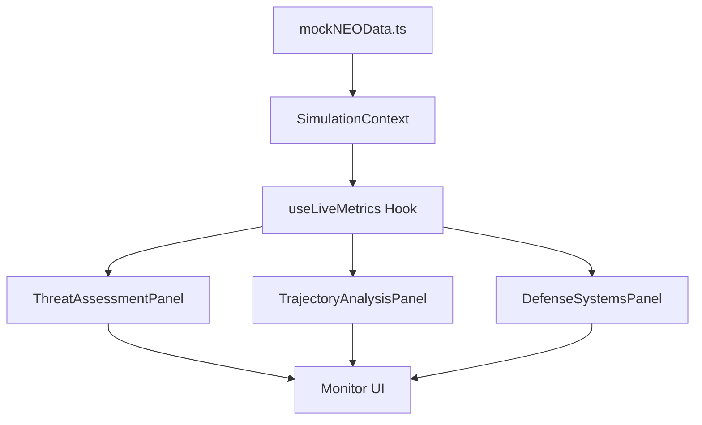

# Monitor Data Flow - NASA Hackstronauts

## 📊 Arquitectura del Sistema de Monitoreo

Este documento explica cómo funciona el sistema de datos en tiempo real para los monitores de amenazas, trayectorias y sistemas de defensa.

## 🔄 Flujo de Datos



## 📁 Estructura de Archivos

### 1. **Datos Base** (`/src/data/mockNEOData.ts`)
Contiene asteroides reales con datos científicos:
```typescript
export const mockNEOs: NEO[] = [
  {
    neo_id: "2000001",
    name: "Apophis",
    diameter_min_m: 340,
    diameter_max_m: 400,
    velocity_km_s: 12.6,
    is_potentially_hazardous: true,
    impact_energy_mt: 1200.0,
    // ... más datos
  }
];
```

### 2. **Contexto Global** (`/src/contexts/SimulationContext.tsx`)
Maneja el estado global de la simulación:
```typescript
interface SimulationContextType {
  selectedAsteroid: Asteroid | null;
  impactCoordinates: { lat: number; lng: number } | null;
  isSimulationActive: boolean;
  simulationStep: 'selection' | 'impact' | 'simulation' | 'results';
}
```

### 3. **Hook de Métricas** (`/src/hooks/useLiveMetrics.ts`)
**NÚCLEO DEL SISTEMA** - Procesa datos y genera métricas en tiempo real:

```typescript
interface LiveMetrics {
  // Métricas de amenaza (para monitores)
  energyMT: number;
  distanceKm: number;
  velocityKmh: number;
  timeToImpact: number;
  
  // Métricas orbitales
  trackingObjects: number;
  averageAltitude: number;
  currentAltitude: number;
  
  // Métricas de sistemas
  containmentProtocols: number;
  patternRecognition: number;
  dataMiningActive: boolean;
  modelAccuracy: number;
  processedQueries: number;
}
```

**Lógica de Actualización:**
- Se actualiza cada 2 segundos cuando `isSimulationActive = true`
- Se actualiza inmediatamente cuando cambia `selectedAsteroid`
- Genera valores simulados basados en datos reales del asteroide

### 4. **Paneles de Monitoreo**

#### A. **ThreatAssessmentPanel** - Evaluación de Amenazas
```typescript
// Calcula métricas de amenaza (implementación actual)
const energy = metrics.energyMT;              // MT (Megatons)
const distance = metrics.distanceKm / 1000;   // K KM
const velocity = metrics.velocityKmh / 1000;  // K KM/H

// Determina nivel de amenaza
const threatLevel = energy > 50 ? 'HIGH THREAT'
                 : energy > 20 ? 'MEDIUM THREAT'
                 : 'LOW THREAT';
```

#### B. **TrajectoryAnalysisPanel** - Análisis de Trayectoria
```typescript
// Genera puntos de trayectoria
const trajectoryPoints = Array.from({length: 20}, (_, i) => ({
  x: (i / 19) * 100,
  y: 20 + Math.sin((i / 20) * Math.PI) * 30 + Math.random() * 10,
  color: i < 17 ? '#10b981' : '#ef4444'
}));

// Métricas de impacto
probability: (metrics.collisionProbability * 100).toFixed(2) + '%'
eta: trajectoryPoints.length * 0.5 + 's'
impact: metrics.impactLocation
```

#### C. **DefenseSystemsPanel** - Sistemas de Defensa
```typescript
// Estado de sistemas basado en métricas
const systems = {
  laserArray: metrics.patternRecognition > 95 ? 100 : metrics.patternRecognition,
  missilePods: metrics.containmentProtocols > 15 ? 100 : (metrics.containmentProtocols / 15) * 100,
  shieldGen: metrics.dataMiningActive ? 100 : 0,
  reactorCore: metrics.modelAccuracy > 98 ? 100 : (metrics.modelAccuracy - 95) * 33.33,
  communication: metrics.processedQueries > 5000 ? 100 : (metrics.processedQueries / 5000) * 100
};
```

## 🔧 Implementación en Nuevo Proyecto

### Notas de integración clave

- Al seleccionar una tarjeta en `src/components/features/neo/NEOList.tsx`, se llama a `setSelectedAsteroid(...)` del `SimulationContext`. Esto dispara `useLiveMetrics()` y actualiza de inmediato los monitores (no es necesario pulsar "Simular Impacto" para que "THREAT ASSESSMENT" cambie).
- La fuente de NEOs proviene de `src/services/neoService.ts`, que intenta la API de NASA con `import.meta.env.VITE_NASA_API_KEY` y usa fallback a `src/data/mockNEOData.ts` si la API falla (por límite o clave inválida).

### Paso 1: Instalar Dependencias
```bash
npm install react typescript
```

### Paso 2: Crear Estructura de Carpetas
```
src/
├── contexts/
│   └── SimulationContext.tsx
├── hooks/
│   └── useLiveMetrics.ts
├── data/
│   └── mockNEOData.ts
├── components/
│   └── monitoring/
│       ├── ThreatAssessmentPanel.tsx
│       ├── TrajectoryAnalysisPanel.tsx
│       └── DefenseSystemsPanel.tsx
└── types/
    └── api.types.ts
```

### Paso 3: Definir Tipos
```typescript
// types/api.types.ts
export interface NEO {
  neo_id: string;
  name: string;
  diameter_min_m: number;
  diameter_max_m: number;
  velocity_km_s: number;
  is_potentially_hazardous: boolean;
  impact_energy_mt: number;
  // ... más propiedades
}

export interface Asteroid {
  id: string;
  name: string;
  diameter: string;
  velocity: string;
  is_hazardous: boolean;
}
```

### Paso 4: Implementar Contexto
Copiar `SimulationContext.tsx` completo del proyecto actual.

### Paso 5: Implementar Hook de Métricas
Copiar `useLiveMetrics.ts` completo - es el corazón del sistema.

### Paso 6: Crear Componentes de Monitoreo
Copiar los 3 paneles de monitoreo y adaptar estilos según necesidades.

### Paso 7: Integrar en App Principal
```typescript
// App.tsx
import { SimulationProvider } from './contexts/SimulationContext';
import { ThreatAssessmentPanel } from './components/monitoring/ThreatAssessmentPanel';

function App() {
  return (
    <SimulationProvider>
      <div className="monitoring-dashboard">
        <ThreatAssessmentPanel />
        <TrajectoryAnalysisPanel />
        <DefenseSystemsPanel />
      </div>
    </SimulationProvider>
  );
}
```

## 🎯 Puntos Clave para la Implementación

### ✅ Lo que SÍ funciona:
- **Datos simulados realistas** basados en asteroides reales
- **Actualización automática** cada 2 segundos
- **Reactividad** a cambios de asteroide seleccionado
- **Métricas coherentes** entre paneles

### ⚠️ Lo que hay que adaptar:
- **Estilos CSS** - Usar tu sistema de diseño
- **Fórmulas de cálculo** - Ajustar según necesidades
- **Intervalos de actualización** - Cambiar frecuencia si es necesario
- **Tipos de datos** - Adaptar interfaces según tu API

### 🔄 Flujo de Integración Recomendado:
1. Copiar tipos y contexto
2. Implementar `useLiveMetrics` 
3. Crear un panel básico de prueba
4. Verificar que los datos fluyen correctamente
5. Implementar los 3 paneles completos
6. Personalizar estilos y métricas

## 📝 Notas Importantes

- **El hook `useLiveMetrics` es independiente** - puede usarse en cualquier componente
- **Los datos son simulados** pero basados en información real de asteroides
- **La actualización es automática** cuando `isSimulationActive = true`
- **Cada panel consume las mismas métricas** pero las interpreta diferente
- **El sistema es escalable** - fácil agregar nuevas métricas o paneles

## 🚀 Extensiones Posibles

- Conectar con API real de NASA
- Agregar más tipos de monitores
- Implementar alertas en tiempo real
- Guardar histórico de métricas
- Agregar configuración de intervalos
- Implementar WebSockets para datos reales

---

**Autor**: Sistema de Monitoreo NASA Hackstronauts  
**Fecha**: 2025-01-05  
**Versión**: 1.0
